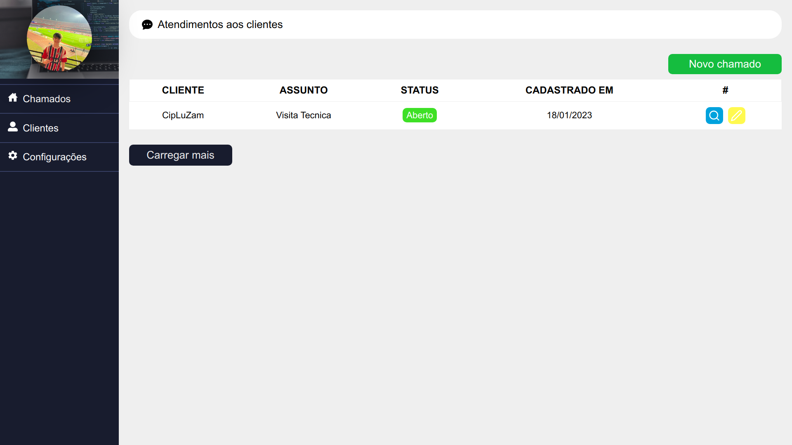
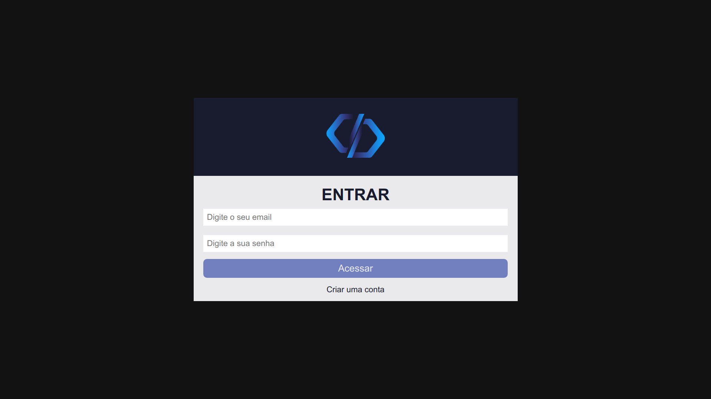
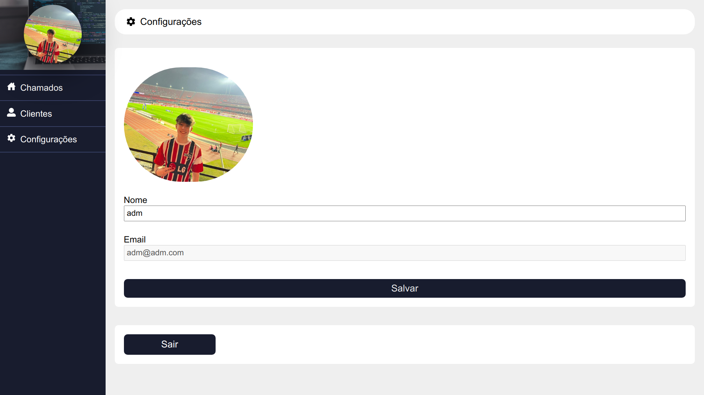

# Sistema de Chamados 📚

## Informações ℹ️

<ul>
    <li>O projeto foi feito para uma empresa na qual precisa manter o gerenciamento de suas atividade</li>
    <li>O projeto tem um sistema de rotas utilizando o <b>react-router-dom</b> tendo duas apenas duas rotas</li>
    <li>O projeto tem um sistema de cadastramento e login de usuários usando o <b>fire base</b></li>
</ul>

## Tecnologias usadas 🖥️

<ul>
    <li>HTML 5</li>
    <li>CSS 3</li>
    <li>JAVASCRIPT</li>
    <li>REACT</li>
    <li>STYLED COMPONENTS</li>
    <li>FIRE BASE</li>
</ul>

## Capturas de tela 📸

## Executar projeto 🤓

<ul>
    <li>Instalar node em sua máquina</li>
    <li>Abrir projeto e dar npm start</li>
    <li>Ou vocẽ pode abrir o projeto na web <a href="https://sistemadechamado.netlify.app/" target="_blank">Clicando aqui!</a></li>

</ul>

## Funcionalidades

<ul>
    <li>Sistema de login e cadastramento</li>
    <li>Edição de foto e nome de perfil</li>
    <li>Adicionar novas empresas</li>
    <li>Adicionar e buscar novos chamados</li>
</ul>

## Status do Projeto 📃

🚀 Concluído

## Contato 📞

<ul>
    <li><a href="https://github.com/fabriluan" target="_blank">Github</a></li>
    <li><a href="https://www.linkedin.com/in/fabricio-cipriano-a72672248/" target="_blank">Linkedin</a></li>
</ul>